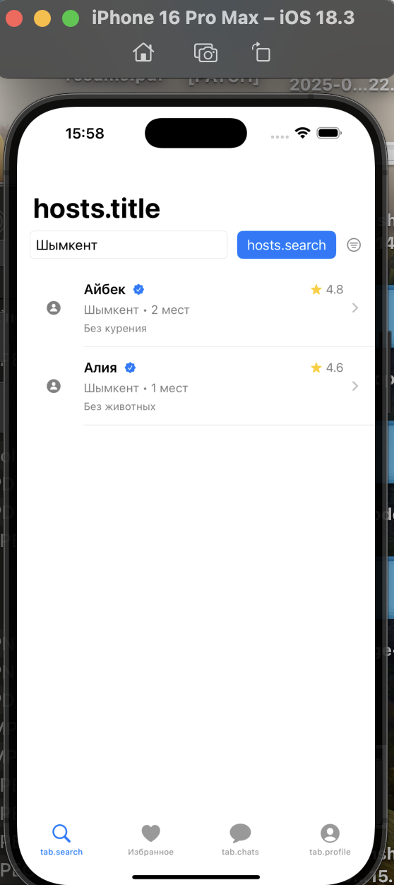
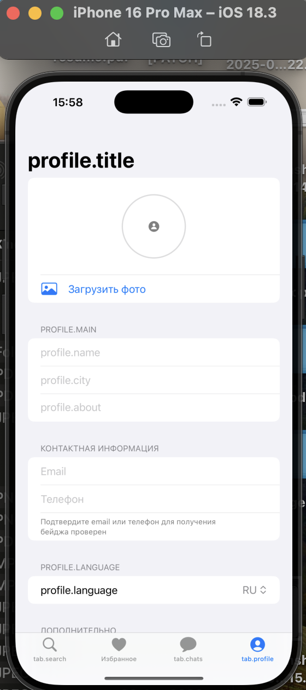
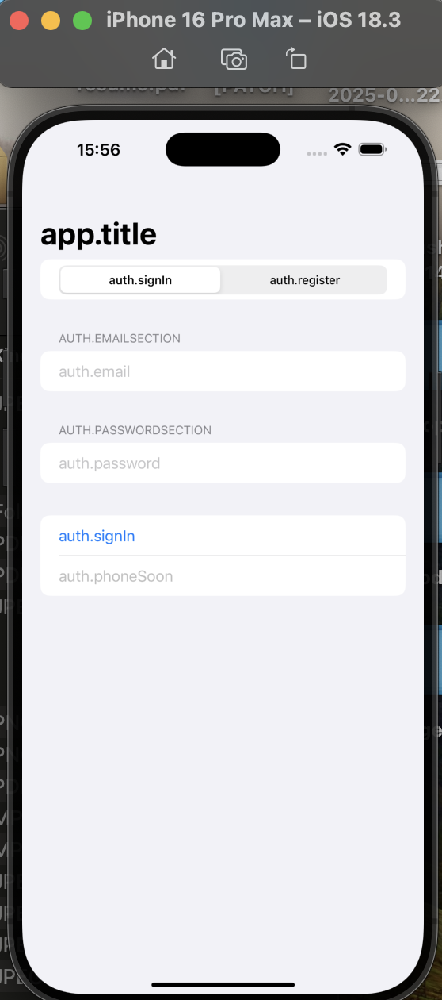

QonaqStay iOS App
=================

QonaqStay is an iOS application built with Swift and SwiftUI. It is designed as a platform for guests and hosts, allowing users to browse host places, save favorites, chat, and manage their profile.

## Project Structure

- `qonaqstay/` – main iOS app target
  - `Domain/` – core models and repository protocols
  - `Data/` – in-memory and Firebase stub repositories
  - `Presentation/` – SwiftUI views and view models
  - `Resources/` – localization files
  - `App/` – app container and composition root

## Screenshots

Screenshots of the main flows are stored in the `screens/` folder at the root of the repository:

- `screens/main.png` – main tab screen
- `screens/profile.png` – profile screen
- `screens/signin.png` – sign-in screen

Rendered in this README:





## Requirements

- iOS 17+
- Xcode 15+
- Swift 5.9+

## Running the App

1. Clone the repository:
   ```bash
   git clone https://github.com/nurgazy008/qonaqstay.git
   ```
2. Open `qonaqstay.xcodeproj` in Xcode.
3. Select an iPhone 16 Pro Max simulator.
4. Build and run the app.

## License

This project is for educational purposes as part of an internship practice.

